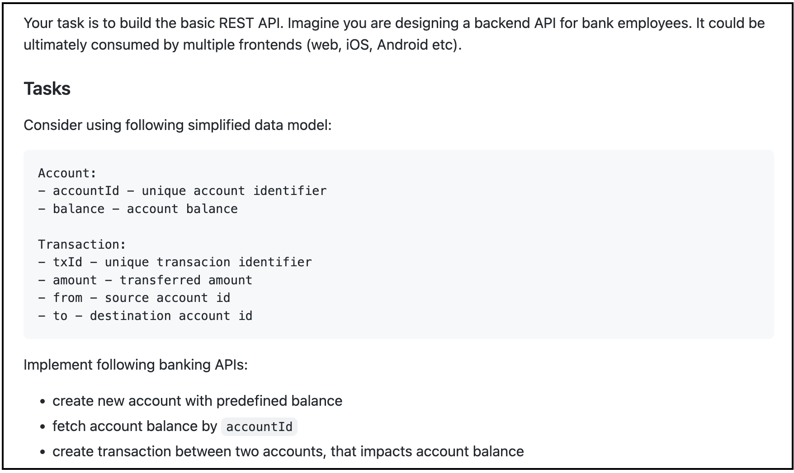
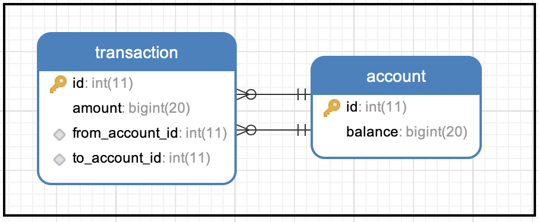
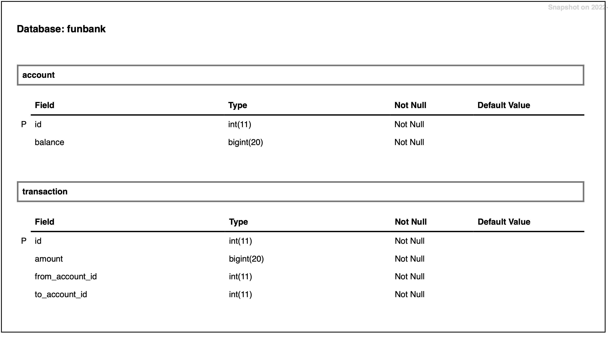

# Fun Bank Service #

Demonstration of Requirements understanding, proposing a solution and implementation by using the latest tools and techniques.

---
- [Distribution](#distribution)
  - [What is this repository for?](#what-is-this-repository-for?)
- [Problem Statement](#problem-statement)
- [Proposed Solution](#proposed-solution)
- [Entities](#entities)
- [Deliverable Content](#deliverable-content)
- [Deliverable Content](#deliverable-content)
  - [Functional Implementation](#functional-implementation)
  - [Non-Functional Implementation](#non-functional-implementation)
- [Development Cycle](#development-cycle)
- [How to Setup](#how-do-i-get-set-up)
  - **[<< Docker Compose >>](#-docker-compose-)**
  - [Developer Setup](#developer-set-up)
  - [Configuration](#configuration)
    - [Docker Build](#build-docker-image)
    - [Docker Run](#run-docker-image)
    - [Docker Run from Registry](#run-docker-image-from-docker-hub)
    - [Docker Stop](#stop-docker-container)
- [Pre-reqs](#pre-reqs)
- [Tools Included](#tools-included)
- [External Tools](#external-tools)
- [Deployments](#deployment)
- [Contribute](#contribution-guidelines)

---

## Distribution ##

- **[Swagger API Docs - Deployed on EC2 Instance](http://ec2-44-211-153-186.compute-1.amazonaws.com:8080/swagger-ui.html)** - **Bonus Requirement**
- A [docker repository](https://hub.docker.com/repository/registry-1.docker.io/naeemark/fun-bank-service) is created, the latest image can be downloaded
- **[Sonar Project](https://sonarcloud.io/dashboard?id=naeemark_fun-bank-service)** - **Bonus Requirement**
- **[Docker Compose](docker-compose.yaml)** - **Bonus Requirement**

---

### What is this repository for? ###

* This app is built as assignment for FunMid.
* Adds different libs to enhance the application quality and performance.
* Using [SWAGGER.IO](www.swagger.io) for documentation and as a working REST-API client
* CI/CD Demonstration using [Github Actions](https://github.com/features/actions)
* Docker containers are used for Build Deployment
* The live environment is established on an EC2 instance to run dockerized build
* Version 1.0.0

---

### Problem Statement:

---
### Proposed Solution:

- By keep the provided instructions in mind, I would prefer to use a [Spring Boot](https://www.tutorialspoint.com/spring_boot/spring_boot_introduction.htm) application for the implementation of required functionality.
- MySQL Database will be used for Dev, Test and Prod environments.
- For testing, I would prefer to use JUnit and Mockito
- There will be a Dockrized Build distribution
- As we are mocking a banking system, there should be a locking system on JPA to avoid auto change in schema.
- There shouldn't be a possibility to modify the database via JPA
- There should be a separate database to be used for testing purposes along with pre-populated data if required.
- For demonstration purpose, an API frontend should be provided...i.e Swagger

#### Entities ####
- As per the given statement, there will be two entities
- I would like to use database constraints to avoid deletion of account which is used as a reference in some transaction
- For symbolic use of locks, I would have locking annotations in required repositories

### Deliverable Content ###

#### Functional Implementation ####
* **POST** `{baseURL}/api/accounts` - creates a new account with a default balance of `100` 
* **GET** `{baseURL}/api/accounts/{accountId}` - Returns an account with balance
* **POST** `{baseURL}/api/transaction` - creates a new transaction between the provided accounts
 ---
#### Non-Functional Implementation ####
* **GET** `{baseURL}/api/health` - Checks the health of the system,
* **GET** `{baseURL}/api/accounts` - Returns List of all accounts (to have an idea of the updated balance for multiple accounts after a transaction)
* **GET** `{baseURL}/api/accounts` - Returns List of all transactions

### Development Cycle:
- Distributes the whole development into Small tasks
- [Each Issue](https://github.com/naeemark/fun-bank-service/issues?q=is%3Aissue) shows a feature
- [Each commit](https://github.com/naeemark/fun-bank-service/commits/master) shows a small progress
- [Pull Requests](https://github.com/naeemark/fun-bank-service/pulls?q=is%3Apr+is%3Aclosed) are done for major tasks

## How do I get set up? ##

### << Docker Compose >> ###
To run the project locally using docker;
- `docker compose up --detach --wait`

To tear down:
- `docker compose down --remove-orphans`

### Developer set up ###
To setup the project locally you need to clone this repo, from `main` branch or some latest `TAG`

### Configuration ###
- Please sync and resolve the `maven` dependencies
- Run `mvn clean install`
- To run tests `mvn clean test`

##### Build Docker Image
- `docker build -t fun-bank-service .`

##### Run Docker Image
- Run `docker run -d -p 80:8080 fun-bank-service`
- You may access the running docker app on [`http://localhost/swagger-ui.html`](http://localhost/swagger-ui.html)

##### Run Docker Image From Docker hub
- **[Docker Image Repository](https://hub.docker.com/repository/docker/naeemark/fun-bank-service)**
- Run `docker run -d --name fun-bank-service -p 80:8080 naeemark/fun-bank-service`
- You may access the running docker app on [`http://localhost/swagger-ui.html`](http://localhost/swagger-ui.html)

##### Stop Docker Container
- Run `docker kill {container-id}`

### Pre-reqs
- JDK 1.8
- Spring Boot
- Docker
- MySQL
- Junit
- Mockito
- Swagger
- IntelliJ IDEA

### Tools Included
- Jacoco
- Sonar
- Swagger
- JPA
- Hibernate
- Github Actions
- EC2 Instance for deployment

#### Auth ####
- No auth system is included in this solution

## External Tools: ##

- **[Github Actions](https://github.com/features/actions)**
- **[Docker](https://www.docker.com/)**
- **[SonarCould](https://sonarcloud.io/)**

## Deployment

- When a `pull request` is merged in `master`, `Github Action` starts and following steps are done by automated CI/CD:
    - Creates Environment and Runs all tests
    - Complete a SonarQube analysis and pushes the results to **[Live Project](https://sonarcloud.io/dashboard?branch=develop&id=naeemark_fun-bank-service)**
    - Makes a deployment to Github packages (Mock)
    - Creates the Docker Image and pushes to [Docker Repository](https://hub.docker.com/repository/registry-1.docker.io/naeemark/fun-bank-service)

- As a next step, it is deployed manually in an ec2 instance.

## Contribution guidelines ##

- Forks are always appreciated

